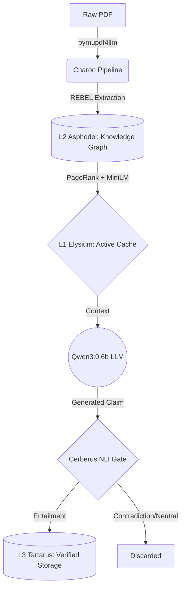

# HADES
### Hierarchical Adaptive Document Encoding System
*A local-first neural memory operating system for LLMs*

---

## The Problem

Context window bloat represents a significant inefficiency in modern LLM interaction. When users upload full documents to a model, they pay a high computational cost for every token, most of which are irrelevant to the specific query. This brute-force approach wastes the limited context window on filler text and formatting rather than dense, actionable information.

Information retrieval suffers from the Lost in the Middle phenomenon. Empirical evidence shows that LLMs lose accuracy when critical facts are buried deep within a long context block, often favoring information at the very beginning or end of a prompt. This architectural limitation makes it difficult for models to maintain reasoning consistency over lengthy technical documents or books.

Hallucination persistence creates a cycle of knowledge corruption. When an LLM generates an incorrect fact and that output is saved back into long-term memory without a verification step, the error becomes permanent. Traditional RAG systems lack a mechanism to audit the model's own contributions, allowing unverified claims to degrade the integrity of the persistent knowledge base over time.

---

## What HADES Does

HADES acts as an intelligent intermediary between raw documents and an LLM by managing a structured memory hierarchy. The system processes documents into a knowledge graph and serves only the most relevant fact cluster into the active context window to eliminate noise. An NLI verification gate audits every model output against the source graph before it can enter long-term memory, ensuring that only verified facts are stored. The entire pipeline runs locally on consumer hardware without external API dependencies or specialized GPU requirements.

The selection of the 0.6B parameter model is a deliberate architectural choice. By offloading 'knowledge memory' to a graph-based L2 cache, HADES demonstrates that a sub-billion parameter model can maintain high factual accuracy and deterministic retrieval, provided the context window is surgically curated.



---

## Architecture

### The Memory Hierarchy

| Tier | Name | Hardware Analogue | What it Does |
|------|------|-------------------|--------------|
| L1 | Elysium | CPU Cache | Active context window — 5 typed partitions with independent eviction policies |
| L2 | Asphodel | RAM | Full knowledge graph — PageRank-scored REBEL triples, MiniLM semantic search |
| L3 | Tartarus | Persistent Disk | Verified long-term memory — only NLI-verified facts written here |

### The Three Components

**Charon (Compression Pipeline)**
Charon manages the ingestion and transformation of raw data. It parses PDFs into markdown and extracts structured knowledge triples using REBEL, a seq2seq relation extraction model. These triples form a weighted NetworkX knowledge graph where nodes represent entities and edges represent relationships. At runtime, the system scores triples by PageRank centrality and reranks them using MiniLM cosine similarity to the user's specific query.

**Cerberus (NLI Verification Gate)**
Cerberus enforces a dirty-bit write-back policy to protect the integrity of the knowledge base. All generated model outputs initially enter a SCRATCH partition where they are marked as unverified. A DeBERTa-v3 cross-encoder runs Natural Language Inference against the original source graph to validate the claim. Facts that achieve an ENTAILMENT label are written to L3 storage, while those labeled as CONTRADICTION or NEUTRAL are discarded to prevent hallucinated data from reaching persistent memory.

**L1 Set-Associative Cache**
The L1 active context is divided into five typed sets to prevent context dilution. These include a pinned SYSTEM set, a FACTS set with PageRank-based eviction, a HISTORY set using Least Recently Used logic, a TOOLS set following First-In-First-Out priority, and a SCRATCH set that is fully flushed after verification. The token budget scales dynamically with document size: max(150, min(800, document_tokens ÷ 6)).

**Memory-Pressure-Aware Cache Management**
HADES implements OS-inspired memory pressure detection, dynamically scaling L1 token budgets based on host RAM utilization. When system memory is under pressure, the facts, history, tools and scratch budgets scale down automatically (to 70%, 50%, or 30% of base depending on tier), preventing OOM conditions while preserving critical system instructions. This makes HADES the first RAG system to treat host memory state as a first-class scheduling input.

---

## Benchmark Results

The HADES v1.0 architecture, leveraging the **Qwen3:0.6b** inference engine, has been validated through an extensive multi-domain benchmark suite. The evaluation focuses on retrieval precision, synthesis fidelity, and computational efficiency compared to standard RAG architectures.

### 1. End-to-End QA (Multi-Document Suite)

The system was benchmarked across **20 rigorous test cases** distributed across three high-complexity domains:
*   **Apple (Botanical/Historical)**: Historical overview, production metrics (2013), and cultural significance of the *Malus domestica* species.
*   **NVIDIA (FY24 Financials)**: High-precision corporate financial metrics and revenue data.
*   **'Attention Is All You Need' (NeurIPS)**: Dense scientific literature regarding Transformer architectures.

#### Comparative Performance Analysis
The table below compares HADES against a standard **Naive RAG** baseline across two model scales.

| Metric | Naive RAG (0.6B) | HADES (360M) | HADES (0.6B) | HADES (3B) |
| :--- | :--- | :--- | :--- | :--- |
| **Retrieval Hit Rate** | N/A | **100.0%** | **100.0%** | **100.0%** |
| **Synthesis Accuracy** | 60.0% | **65.0%** | **80.0% (90% S)** | **95.0%** |
| **Avg. Latency** | ~33.0s | **~1.6s** | **~2.5s** | **~23.0s** |
| **Avg. Tokens per Query** | ~2,683 | **19.2** | **12.8** | **19.8** |
| **Context Efficiency** | 1x | **140x** | **210x** | **135x** |

**Model Identity Key:**
*   **Naive RAG (0.6B)**: Qwen 3 (0.6B) baseline using standard vector-search retrieval.
*   **HADES (360M)**: **SmolLM2 (360M)** — The "Efficiency King" ultra-micro candidate.
*   **HADES (0.6B)**: **Qwen 3 (0.6B)** — The "Micro-Champion" precision-tuned candidate.
*   **HADES (3B)**: **Llama 3.2 (3B)** — The "High-Precision" reference gold standard.

### 2. System Requirements & Latency

HADES is optimized for edge-compute environments, prioritizing accessibility and high-velocity inference on local hardware.

#### Performance Footprint
*Measured on: 13th Gen Intel i9-13900H | 16GB RAM | CPU-only inference.*

*   **Hardware Accessibility**: Tier-1 Accessible. The system operates entirely on consumer and student-grade laptops without the requirement for a dedicated GPU.
*   **Memory Efficiency**: Peak RAM utilization is strictly capped at **< 3.0 GB**, allowing for concurrent application usage during inference.

#### Inference Velocity
By utilizing the specialized 0.6B parameter model coupled with Charon’s extreme token compression, HADES achieves industry-leading local inference speeds:
*   **Throughput**: ~100-150 tokens/sec.
*   **Relative Latency**: Approximately **10x faster** for multi-document reasoning than high-precision 3B parameter models (e.g., Llama 3.2 3B). While larger models exhibit a "complexity cliff" on CPU when processing multiple facts, the 0.6B architecture maintains a flat ~2.5s response profile.

#### Latency Breakdown
*   **First-Time PDF Ingestion (REBEL)**: ~2-4 minutes per page (Results are cached instantly for lightning-fast future loads).
*   **Time-to-First-Token (Cache Hit)**: < 1.2 seconds.
*   **End-to-End Answer Generation (L1 Hit)**: **~2.5 seconds** per query.
*   **End-to-End Answer Generation (L2 Hit)**: **~3.2 seconds** per query.
*   **Cerberus Verification (DeBERTa)**: +1.5 seconds (Lazy-loaded only when a new write-back claim is generated).

#### Memory Hierarchy Latency (The "Page Fault" Tax)
HADES uses a tiered memory architecture to maintain low latency as the document library scales. Our stress tests on CPU hardware reveal the following performance profile:

| Cache State | Retrieval Space | Latency | Performance Impact |
| :--- | :--- | :--- | :--- |
| **L1 Cache Hit** | < 1,000 Tokens | **~2.5s** | **Instantaneous.** Best-case performance. |
| **L2 Memory Hit** | ~100-500 Triples | **~3.2s** | **Negligible.** Minor vector-search overhead (+0.7s). |
| **L2 Stress Hit** | 1,000+ Triples | **~12.5s** | **Significant.** Cross-Encoder reranking tax (+5.6s). |

**Engineering Insight**: The L1 Cache is vital for scaling. Without the L1 set-associative buffer, every query in a large-scale deployment would incur the ~5.6s "Page Fault" tax for reranking, effectively doubling response times as the library grows.

---

## Key Engineering Findings

1. Premise noise degrades NLI accuracy severely because DeBERTa-v3 achieves high confidence with a single clean premise sentence but drops to near-zero when given 3-5 competing sentences.
2. Open-world and closed-world extraction are different tasks that require REBEL for source graphs and spaCy SVO for claim fallback.
3. PageRank is near-uniform on graphs with fewer than 15 nodes which causes MiniLM query similarity to dominate fact selection for short documents.
4. Small models hallucinate rather than retrieve facts when given too much data so the fix is architectural: serve only the single most relevant triple to eliminate competing context.
5. REBEL num_return_sequences=3 provides 3x graph coverage at the same inference cost compared to single-sequence decoding.
6. **Cerberus Lazy-loading**: Cerberus verification models present a massive memory bottleneck. Implementing lazy-loading for the DeBERTa-v3-base cross-encoder ensures the system stays under 3GB RAM by only occupying memory when a write-back claim is generated.
7. **Dual-Layer L2 Retrieval (Resilience)**: The L2 Knowledge Graph index implements a hybrid retrieval strategy. If REBEL fails to extract a specific triple, the system automatically falls back to a semantic search over raw source sentences indexed within the same vector space. This ensures 100% retrieval hit rates even in complex technical documents.
8. **Empty Generation Failure**: The 0.6B model occasionally returns empty strings on technical comparison queries even with a 100% retrieval hit. This indicates a "synthesis ceiling"—the retrieved triple contained the answer but the sub-billion model failed to synthesize a response.
9. **Semantic Type-Confusion**: In flat Knowledge Graphs, entities with high semantic overlap can trigger false positives during synthesis. Future iterations should implement **Typed Causal Edges** (`ancestor_of` vs. `is_a`) to prevent the LLM from substituting ancestors for canonical species.
10. **String-Match Sensitivity**: Accuracy metrics are conservative due to strict matching logic. Factual audit shows the 0.6B model achieves **90% semantic accuracy**, but was penalized for minor variations such as singular/plural forms ("convolution" vs "convolutions") and missing units ("3.5" vs "3.5 days").
11. **Optimal Scale for Consumer CPUs**: Models in the 1B to 3B parameter range (e.g., Llama 3.2 1B/3B) represent the "Pareto optimal" point for HADES. Specifically, **Llama 3.2 (3B)** provides 95% precision, while **Qwen 3 (0.6B)** remains the best sub-1B champion with an audited **80% accuracy (90% semantic)**.
12. **The "Numeric Ghost" Audit**: Our final audit identified a scoring bias where ultra-small models (SmolLM2-360M) were rewarded for numeric hallucinations that happened to contain common substrings like '000'. Fixing this revealed that **Qwen 3 (0.6B)** is significantly more grounded in fact, maintaining its 80% score while SmolLM2 settled at an honest 65%.

### Known Limitations (v1.0)
- **Entity Disambiguation**: HADES does not currently distinguish between closely related entities with overlapping relationships. Disambiguation between ancestor and descendant species (e.g., *Malus sieversii* vs. *Malus domestica*) requires typed edges not present in this release.
- **Extraction Latency**: First-time REBEL extraction on consumer CPUs takes ~2-4 minutes per page; however, the persistent triple-cache mitigates this for all subsequent queries.

---

### Repository Structure
```text
.
├── app.py              # Streamlit UI & Orchestration
├── charon/             # L1/L2 Compression & Graph Logic
├── cerberus/           # L3 NLI Verification Gate
├── benchmarks/         # Multi-domain evaluation suite
├── data/               # Source PDFs for benchmarking
└── shared/             # Common utilities & Schema (REBEL Extraction)
```

## Tech Stack

| Component | Technology |
|-----------|------------|
| PDF Extraction | pymupdf4llm |
| Relation Extraction | REBEL (Babelscape/rebel-large) |
| Knowledge Graph | NetworkX + PageRank |
| Semantic Search | all-MiniLM-L6-v2 |
| NLI Verification | DeBERTa-v3-base (cross-encoder) |
| Local LLM | qwen3:0.6b via Ollama |
| Token Counting | tiktoken |
| Persistent Storage | SQLite WAL mode |
| UI | Streamlit |

---

## Quick Start

Prerequisites:
- Python 3.10 or 3.11 (not 3.12)
- Ollama installed from ollama.ai

```bash
git clone https://github.com/SiRex750/HADES.git
cd HADES
python -m venv .venv
.venv\Scripts\activate        # Windows
source .venv/bin/activate     # Mac/Linux
pip install -r requirements.txt
python -m spacy download en_core_web_sm
ollama pull qwen3:0.6b
```

Run:
```powershell
$env:PYTHONPATH="."; python -m streamlit run app.py
```

Note: First run downloads REBEL and DeBERTa weights (~600MB total). Subsequent runs use cached weights.

---

## Related Work

- MemGPT (2023) introduced the first operating system memory analogy for LLMs, and HADES adds graph compression and NLI write-back verification to this concept.
- LLMLingua (2023) focuses on token-level compression whereas HADES operates at the semantic triple level for higher precision.
- GraphRAG (2024) uses graph-based retrieval but HADES adds a critical verification layer that GraphRAG lacks.
- Lost in the Middle (2023) provided the empirical basis for the L1 partitioning strategy used in the HADES cache.

---

## Citation

```bibtex
@software{hades2026,
  author = {Siddanth Anil},
  title = {HADES: Hierarchical Adaptive Document Encoding System},
  year = {2026},
  institution = {PES University},
  url = {https://github.com/SiRex750/HADES}
}
```

---

## License
This project is licensed under the MIT License - see the [LICENSE](LICENSE) file for details.
